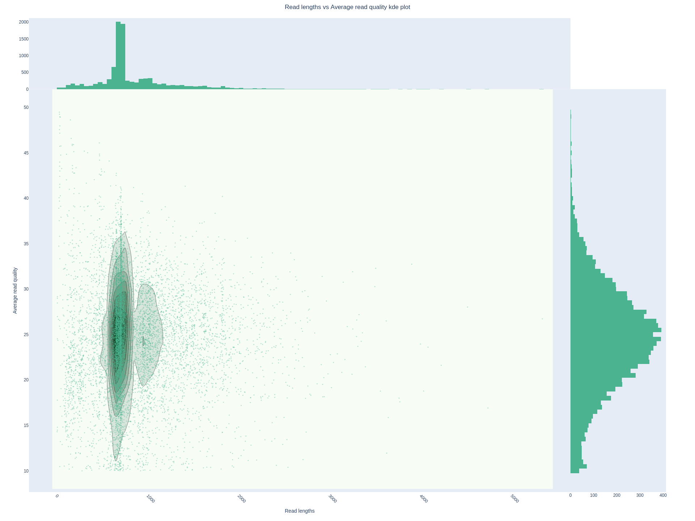
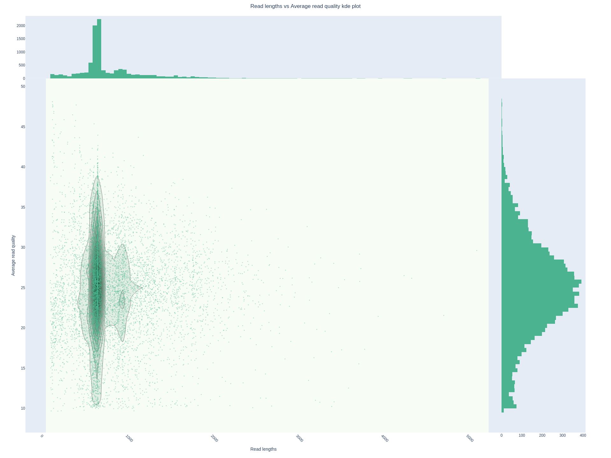
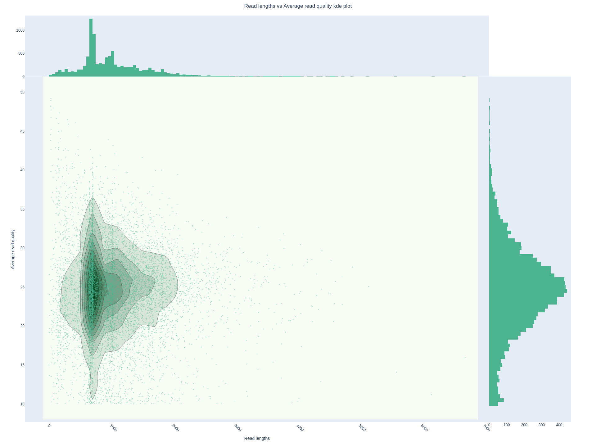

# Master thesis project

This is a pilot version of the NAT-annotation pipeline using long-read RNA-seq (Nanopore). These libraries were prepared using cDNA (PCR-amplified) protocol.

## Data

### RNA-seq datasets

RNA-seq of _healthy person_ **SRR36191871** was downloaded from [NCBI SRA](https://www.ncbi.nlm.nih.gov/sra/SRX31228964[accn])

```
prefetch SRR36191871
fatserq-dump SRR36191871/
```

Resulting file: `SRR36191871.fastq`
Shasum: `d2162ac850b042b2b9ccf1fb740442da5e652fa6`

---

RNA-seq from patient with lung cancer **SRR36191863** was downloaded from [NCBI SRA](https://www.ncbi.nlm.nih.gov/sra/SRX31228972[accn])

```
prefetch SRR36191863
fatserq-dump SRR36191863/
```

Resulting file: `SRR36191863.fastq`
Shasum: `027b2ce68de83c1e7947519f25a5ccd8ad2fe243`


### Reference genome

Reference genome **GRCh38.p14** was downloaded from [NCBI FTP](https://ftp.ncbi.nlm.nih.gov/genomes/all/GCF/000/001/405/GCF_000001405.40_GRCh38.p14/) using command:

```
wget "https://ftp.ncbi.nlm.nih.gov/genomes/all/GCF/000/001/405/GCF_000001405.40_GRCh38.p14/GCF_000001405.40_GRCh38.p14_genomic.fna.gz"
```

---

Another version of reference genome **GRCh38.p14** was downloaded from [EBI FTP](https://ftp.ebi.ac.uk/pub/databases/gencode/Gencode_human/release_49/GRCh38.primary_assembly.genome.fa.gz) using command:
```
wget https://ftp.ebi.ac.uk/pub/databases/gencode/Gencode_human/release_49/GRCh38.primary_assembly.genome.fa.gz
```


### Reference annotation

Reference genome annotation **GenCode V49** was downloaded from [GENCODE FTP](https://ftp.ebi.ac.uk/pub/databases/gencode/Gencode_human/release_49/) using command:

```
wget "https://ftp.ebi.ac.uk/pub/databases/gencode/Gencode_human/release_49/gencode.v49.annotation.gtf.gz"
```


## Data Quality

### **Healthy**

#### **NanoPlot**
```
NanoPlot --fastq SRR36191871.fastq  -o SRR36191871_nanoplot  
```

Header


Length Quality Scatter Plot



#### **Porechop**
```
porechop -i SRR36191871.fastq -o SRR36191871_trimmed.fastq --threads 32 &
```

#### **Filtlong**
```
filtlong \
  --min_length 100 \
  SRR36191871_trimmed.fastq > SRR36191871_clean.fastq
```

#### **NanoPlot after filtering**
```
NanoPlot --fastq SRR36191871.fastq  -o SRR36191871_nanoplot  
```

Header


Length Quality Scatter Plot



---


### **Cancer**

#### **NanoPlot**
```
NanoPlot --fastq SRR36191863.fastq  -o SRR36191863_nanoplot 
```

Header


Length Quality Scatter Plot



#### **Porechop**
```
porechop -i SRR36191863.fastq -o SRR36191863_trimmed.fastq --threads 20
```


---


## Alignment

### Minimap2

**Using NCBI reference genome**
```
time minimap2 -ax splice -s 40 -G 350k -t 25 --MD --secondary=no ref/GCF_000001405.40_GRCh38.p14_genomic.fna rnaseq/SRR36191871_clean.fastq | samtools view -hb - | samtools sort - > bam/SRR36191871_clean.genomealigned.bam; samtools index bam/SRR36191871_clean.genomealigned.bam &
```

Resulting files:
`SRR36191871_clean.genomealigned.bam`
`SRR36191871_clean.genomealigned.bam.bai`

---

**Using GENCODE reference genome**
```
time minimap2 -ax splice -s 40 -G 350k -t 25 --MD --secondary=no ref/GRCh38.primary_assembly.genome.fa rnaseq/SRR36191871_clean.fastq | samtools view -hb - | samtools sort - > bam/SRR36191871_clean.GENCODE.bam; samtools index bam/SRR36191871_clean.GENCODE.bam &
```
real    44m48.707s   
user    756m20.745s   
sys     34m46.680s   

Resulting files:
`SRR36191871_clean.GENCODE.bam`
`SRR36191871_clean.GENCODE.bam.bai`


## Transcriptome assembly: FLAIR

### Installation of intronProspector
```
git clone https://github.com/diekhans/intronProspector.git
cd intronProspector/
./configure --with-htslib=$CONDA_PREFIX
make -j $(nproc)
make install PREFIX=$CONDA_PREFIX
intronProspector --version
```

### Obtaining novel splice junction reference
```
samtools faidx GCF_000001405.40_GRCh38.p14_genomic.fna 

time intronProspector --genome-fasta=ref/GCF_000001405.40_GRCh38.p14_genomic.fna --intron-bed6=SRR36191871_clean.IPjunctions.bed -C 0.0 bam/SRR36191871_clean.genomealigned.bam &
```

Resulting .BED file is stored in **intron_junctions** directory

---

**FOR GENCODE REF**
```
samtools faidx GRCh38.primary_assembly.genome.fa 

nohup intronProspector --genome-fasta=ref/GRCh38.primary_assembly.genome.fa --intron-bed6=SRR36191871_clean.IPjunctions.GENCODE.bed -C 0.0 bam/SRR36191871_clean.GENCODE.bam &
```

Resulting file:
`SRR36191871_clean.IPjunctions.GENCODE.bed`


### Installing FLAIR
```
conda env create -n flair --file https://github.com/BrooksLabUCSC/flair/releases/download/v3.0.0b1/flair_conda_env.yaml
conda activate flair
conda env update --name flair --file https://github.com/BrooksLabUCSC/flair/releases/download/v3.0.0b1/flair_diffexp_conda_env.yaml
```

### Generating transcriptome
```
nohup flair transcriptome \
  -g ref/GCF_000001405.40_GRCh38.p14_genomic.fna \
  -f gtf/gencode.v49.annotation.gtf \
  --junction_bed intron_junctions/SRR36191871_clean.IPjunctions.bed \
  --junction_support 2 \
  -b bam/SRR36191871_clean.genomealigned.bam \
  -o SRR36191871_clean \
  > SRR36191871_clean.flair.log 2>&1 &
```

First run:
`9b248d88-be75-485e-8d44-ec1dd19a7572/`
`6f37a9f3-4f6e-4eed-80d7-c5df9f9800ee/`

Second run:
`92601ad0-9bd0-4f05-86a1-397cf945db76`


**FOR GENCODE REFERENCE**
```
nohup flair transcriptome \
  -g ref/GRCh38.primary_assembly.genome.fa \
  -f gtf/gencode.v49.annotation.gtf \
  --junction_bed intron_junctions/SRR36191871_clean.IPjunctions.GENCODE.bed \
  --junction_support 2 \
  -b bam/SRR36191871_clean.GENCODE.bam \
  -o SRR36191871_clean_GENCODE \
  > SRR36191871_clean.flair.GENCODE.log 2>&1 &
```

Resulting files:
`7d92fd78-e53d-4be6-bfab-3f883b70da26`
``

## Scripts

new new
